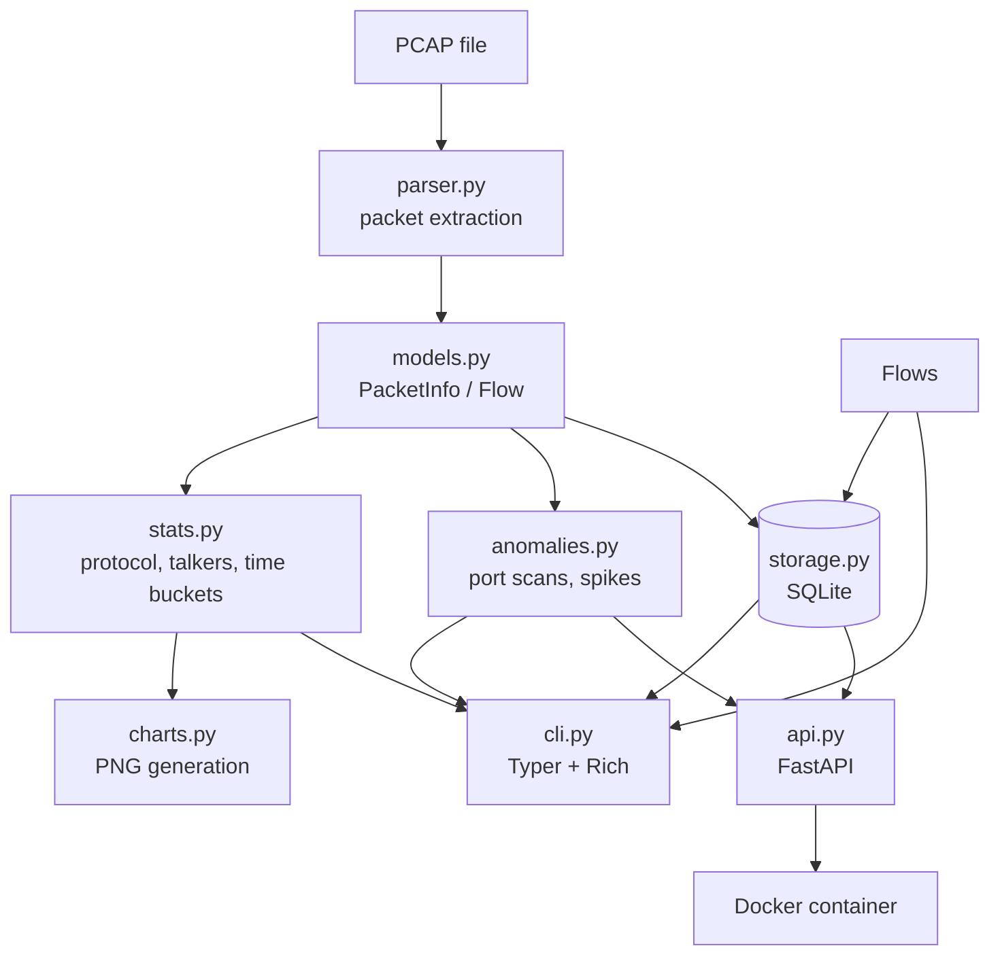
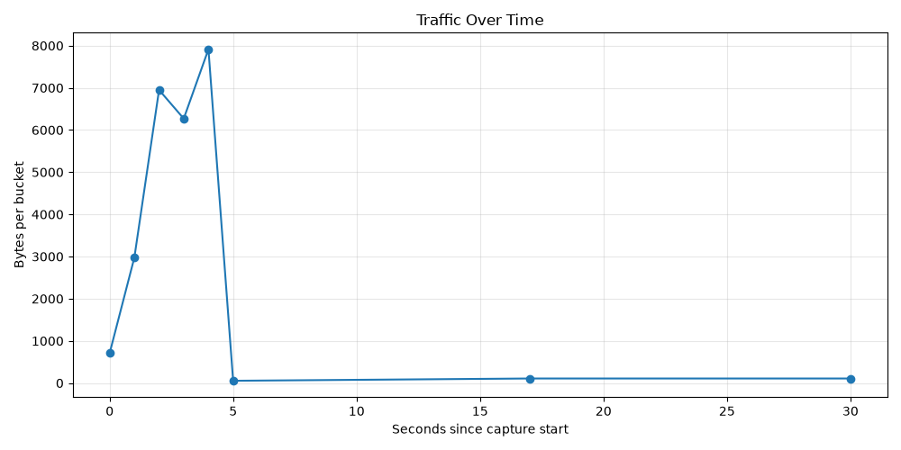
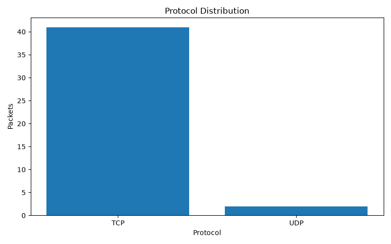
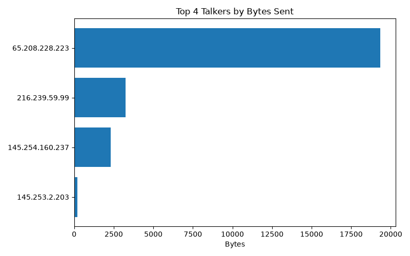
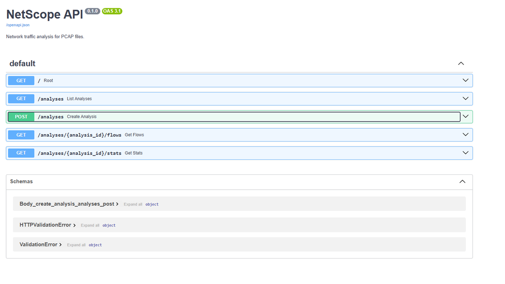
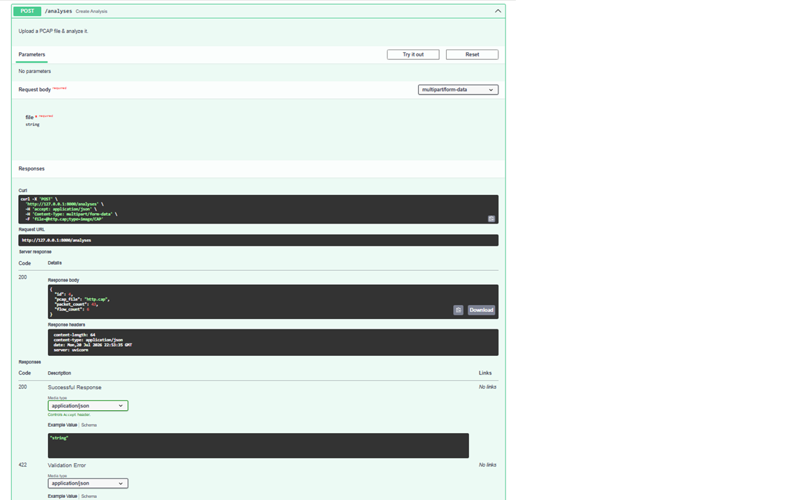

# NetScope


NetScope is a Python-based network traffic analysis platform that processes PCAP files and extracts actionable insights about network activity (packet metadata, flow aggregation, and traffic summaries from the command line).

## Features

- [x] Parse PCAP files (IP, TCP, UDP w/ ports & timestamps)
- [x] Aggregate network flows by 5-tuple
- [x] Traffic summaries and protocol breakdown (CLI)
- [x] Protocol statistics and visualizations
- [x] SQLite storage
- [x] REST API
- [x] Docker support
- [x] Basic anomaly detection

## Demo

## Architecture

NetScope is built in layers: a core analysis engine with 2 independent interfaces.


The engine modules have no knowledge of the CLI or API (both interfaces are thin wrapper over the same tested core).

## Installation

```bash
git clone https://github.com/susanyoon/netscope.git
cd netscope
pip install -e ".[dev]"
```

## Usage

```bash
netscope summary capture.pcap    # high-level traffic summary
netscope flows capture.pcap      # flow table, sorted by bytes
netscope flows capture.pcap --sort-by packets
netscope chart capture.pcap      # generate PNG visualizations
netscope analyze capture.pcap    # parse & save to database
netscope history                 # list saved analyses
netscope anomalies capture.pcap  # detect port scans & traffic spikes
```
*CLI flow table output:*


## Charts

`netscope chart capture.pcap` generates visualizations:





## API

Run the API server:

```bash
fastapi dev netscope/api.py
```




Interactive docs at `http://127.0.0.1:8000/docs`

## Running with Docker

```bash
docker compose up --build
```
No Python installation required (the container includes everything)
Then open `http://localhost:8000/docs`

## Running Tests

```bash
pytest
```

## Tech Stack
- Python
- Matplotlib
- pytest
- Scapy
- Typer
- Rich
- FastAPI 
- SQLite
- Docker
- GitHub Actions 

## Project Status
Under active development.
See [Issues](https://github.com/susanyoon/netscope/issues) for the roadmap.

